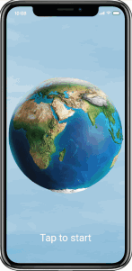

# User Manual

## Contents

- [Start Screen](./start-screen.html)
  - [Search Bar](./start-screen.html#Search-Bar)
- [Menu Screen](./menu-screen.html)
  - [Country Details](./menu-screen.html#Country-Details)
  - [Breakdown](./menu-screen.html#Breakdown)

### For easy access the gif below will be handy

## Application Details

Application allows users to view countries of interest and keep updated on the political conditions of that country. The user can search for specific countries using a search bar, view a list of countries and click on the individual country to view more information on how that country ranks in the world.

The ranking system using a multi-factor system that allows users to see how a country ranks compared to others. The Application is intended to help travellers keep track of the countries they are travelling.

## Developers

| Developer                                | Role           |
| ---------------------------------------- | -------------- |
| Cahil Foley (student ID: 10433572)       | Head Developer |
| Beah Teah (student ID: 10466604)         | Developer      |
| Katherine Lenane (student ID: 10425146)  | Developer      |
| Duncan Fitzgerald (student ID: 10456963) | Developer      |
