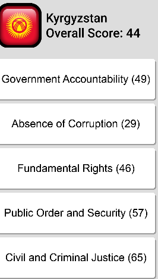
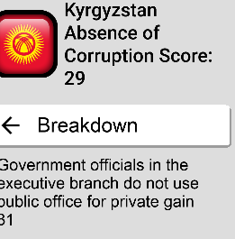

# User Manual

[Go back](./index.html)

## Menu Screen:

The Manu screen function allows the user to view listed items. The items on the list include

- country list for quick access to the list of countries, simply tap on the menu screen icon, in the top left of the screen, and tap on the country list option
- alerts, this allows the user to access alerts for each country and functions as an, keep-Up-To-Date, feature that offers the users important information at their fingertips.

### Country Details

When a user clicks on a country they are taken to another page called Country Details. This page allows the user to see how each country ranks in the fields of Absence of Corruption and Government Accountability. At the top of the page, under the Countries name, each country is given an overall score, and this is a good measurement for the overall freedom and safety of the nation.

### BreakDown

If the User wants more details about each category, all they need to do is click on the category and this takes them to another

page which displays the full internal details of the respective category.

The Average score for all the details in the Absence of Corruption tab is also given at the top of the screen, this is intended to

simplify all the information for users that are not interested in statistic.

To return to the previous page, simply click on the Breakdown tab. Also, to go back to the view All nations screen simply use the menu screen.

> As seen in the image below. In this example the user has clicked on the Absence of Corruption tab and they are taken to this new view

[Go back](./index.html)
