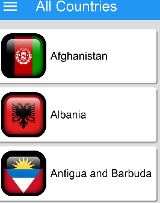
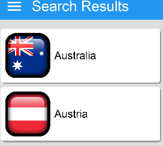

# User Manual

[Go back](./index.html)

## Start Screen

Click the screen and the application will load the country list, this list has the name of each respective country and its flag.

The user can now also scroll up or down the list and find the specific nation they are seeking.

From the starting screen the user has lot of cool options including:

- Using the menu screen and clicking on a country to view fun and informative details about that country.

### Search Bar

Using the search bar requires the users to click on the search bar function and type the name of a country, this is convenient and means that users do not have to scroll through a list of over 100 different countries.

The Search Bar function is found in the Menu Screen and when the User clicks on the search bar a keyboard will appear and this allows the user to types.

#### (The image below shows the search-Bar in the menu screen with the country list and the Rankings)

#### (The image below shows what happens after a user types in the word Aust. Doing this will return all values that match these letters)

[Go back](./index.html)
